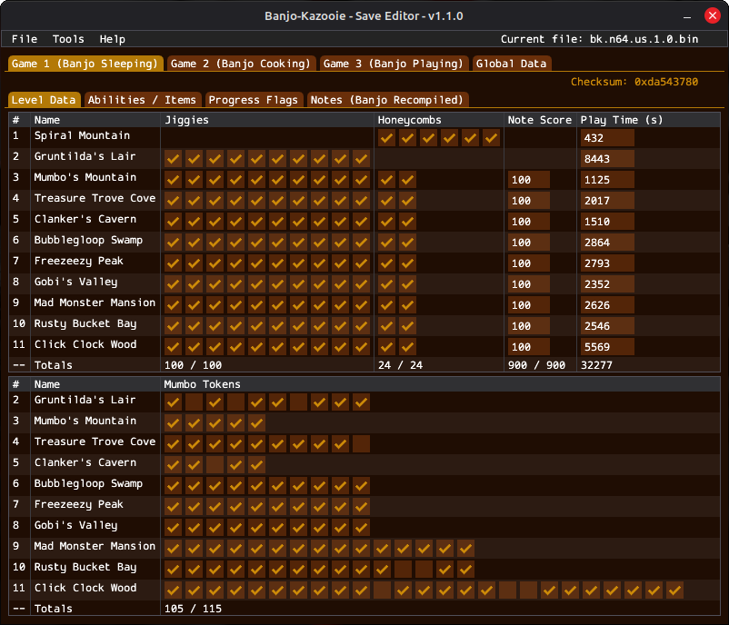
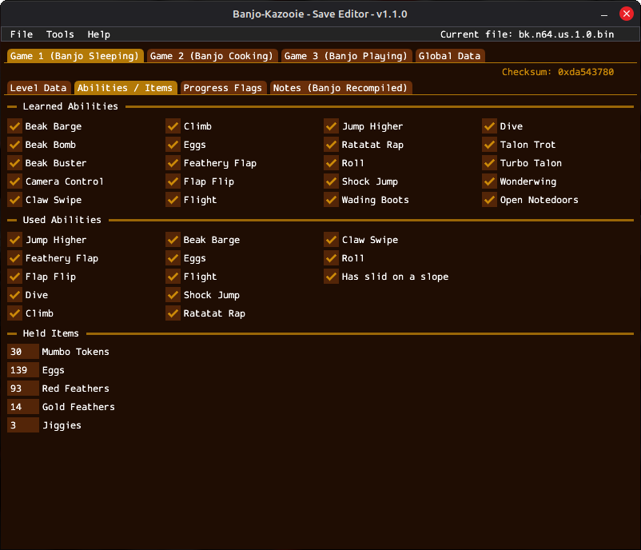
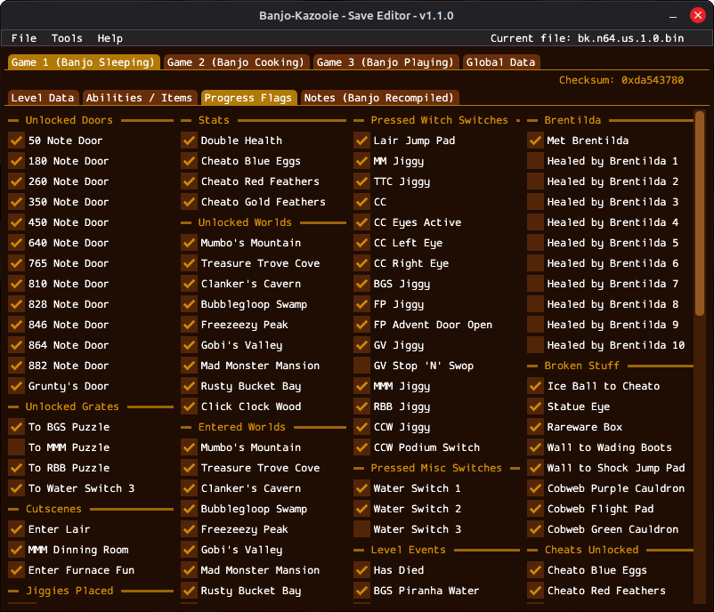
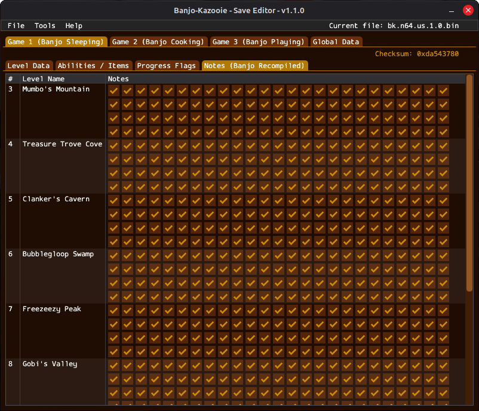

# Banjo-Kazooie - Save Editor

This is a Banjo-Kazooie cross-platform save editor. It is able to edit mostly everything of a save file from the Nintendo 64 version.

## Requirements

The program runs on Windows and Linux and requires a GPU compatible with OpenGL 3.3.

## Features

- It can edit save files from the Nintendo 64 version of the game.
- It can edit pretty much everything, except probably some still unknown stuff.
- You can copy and delete save slots.

## Screenshots

