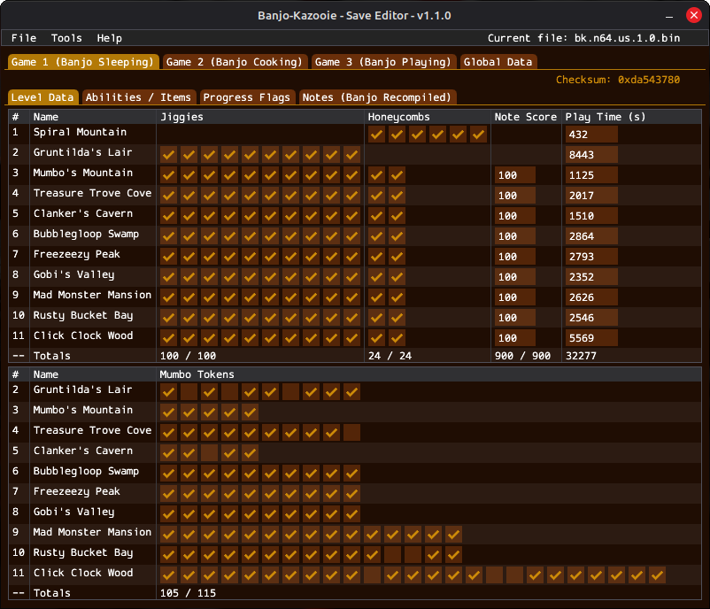
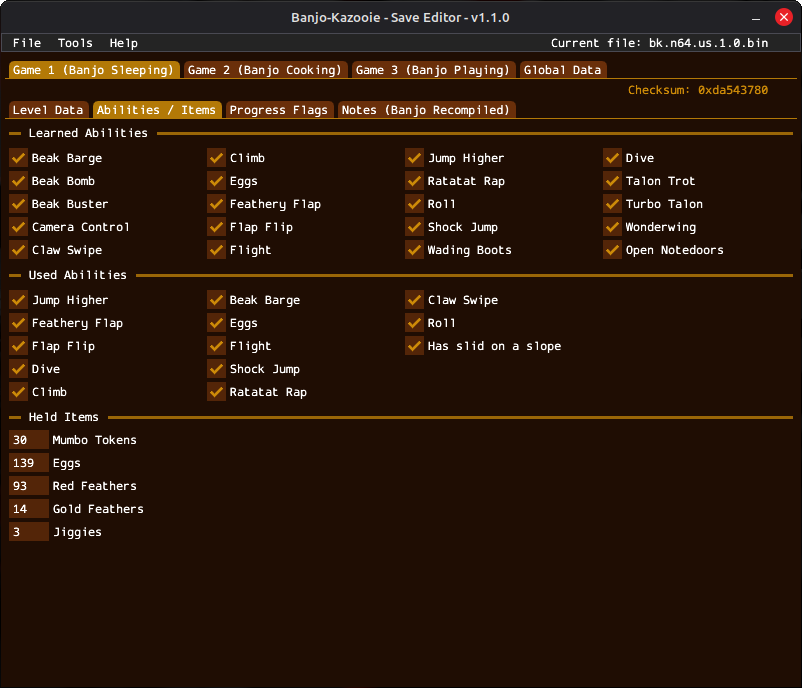
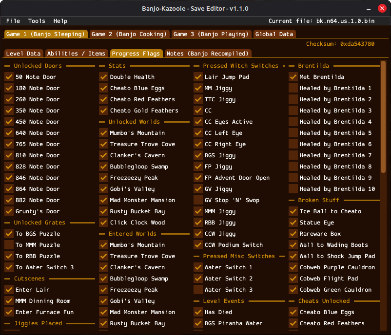
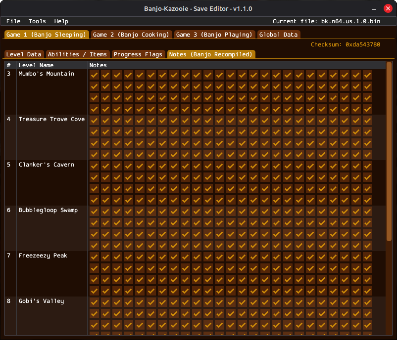
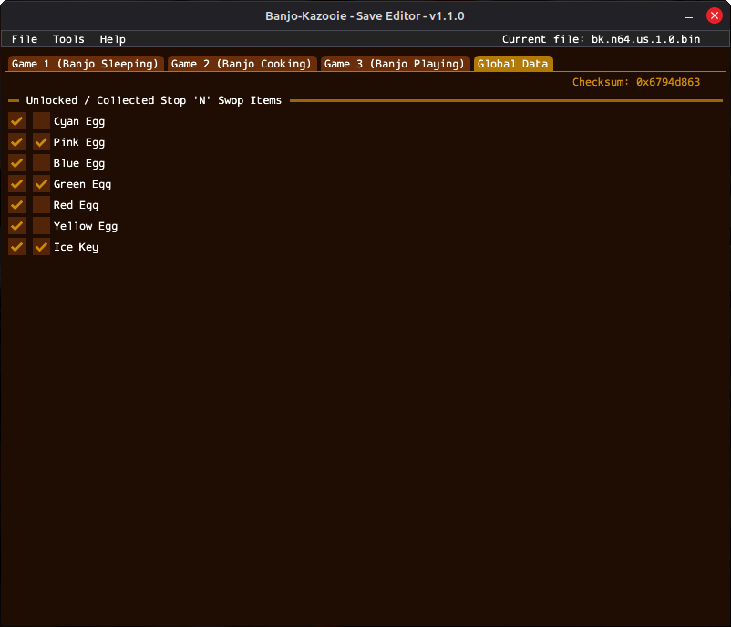

# Banjo-Kazooie - Save Editor

This is a Banjo-Kazooie cross-platform save editor. It is able to edit mostly everything of a save file from the Nintendo 64 version and the Banjo Recompiled PC port.

## Requirements

The program runs on Windows and Linux and requires a GPU compatible with Vulkan or Direct3D 12.

## Features

- It can edit save files from the Nintendo 64 and Banjo Recompiled PC versions of the game.
- It can edit pretty much everything, except probably some still unknown stuff.
- It can copy and delete save slots.

## Changelog

You can check the changelog [here](https://github.com/MaikelChan/BKSaveEditor/blob/main/CHANGELOG.md).

## Screenshots

